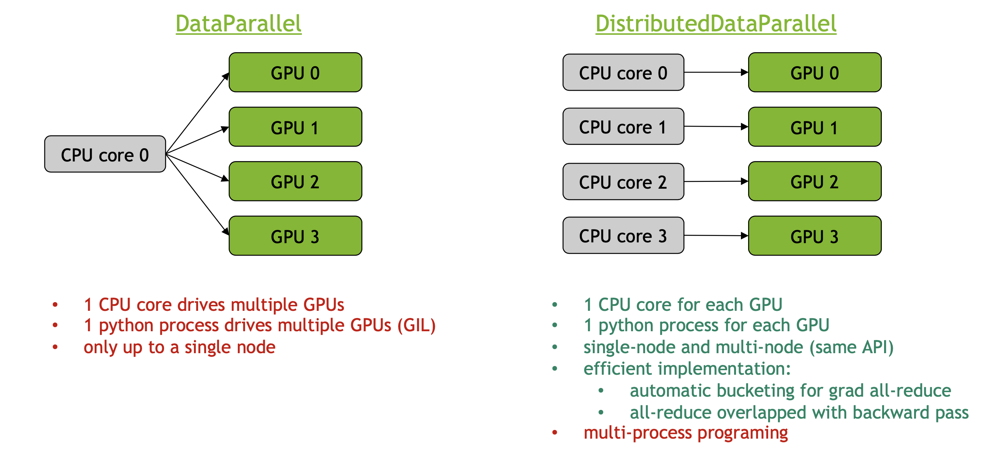

# ECCV 2020 mixed precision Tutorial
[website](https://nvlabs.github.io/eccv2020-mixed-precision-tutorial/)

## Introduction

# Basics and Fundamentals

## Training Neural Networks with Tensor Cores


# Code Optimization Tricks

## PyTorch Performance Tuning Guide
[slides](https://nvlabs.github.io/eccv2020-mixed-precision-tutorial/files/szymon_migacz-pytorch-performance-tuning-guide.pdf)
[video](https://youtu.be/jF4-_ZK_tyc)
### Use async data loading/ augmentation
- Pytorch `DataLoader` supports asynchronouse data loading / augmentation
- By defualt, `num_workers=0` and `pin_memory=False`. 
- Tips:
    - Use `num_workers>0` to enable asynchronous data processing
    - It's almost always better to use `pin_memory=True`

### Enable cuDNN autotuner
For Convolutional Neural Networks, enable cuDNN autotuner by setting:
```python
torch.backends.cudnn.benchmark = True
```
- cuDNN supports many algorithms to compute convolution
- autotuner runs a short benchmark and selects the algorithm with the best performance (both forward and backward passes)

### Increase the batch size, disable debug APIs and remove unnecessary computation
- Increase the batch size to max out GPU memory
    - often AMP reduces mem requirements -> in crease batch size even more

- When increasing the batch size:
    - Tune learning rate, add learning rate warmup and learning rate decay, tune weight decay
    - or switch to optimizer designed for large-batch training
        - [LARS](https://arxiv.org/abs/1708.03888)
        - [LAMB](https://arxiv.org/abs/1904.00962)
        - [NVLAMB](https://medium.com/nvidia-ai/a-guide-to-optimizer-implementation-for-bert-at-scale-8338cc7f45fd)
        - [NovoGrad](https://arxiv.org/pdf/1905.11286.pdf)
- Disable bias for convolutions directly followed by a batch norm
    - Batch norm already includes the addition of the bias term. Recap that batch norm is"
        ```formula
        gamma * normalized(x) + bias
        ```
        So there is no need and it makes no sense to add another bias term in the convolution layer. <br>
        Simply speaking batch norm shifts the activation by their mean values. Hence, any constant will be canceled out.
    [ref](https://stackoverflow.com/questions/46256747/can-not-use-both-bias-and-batch-normalization-in-convolution-layers)
### Use building blocks from NVIDIA APEX
- NVIDIA APEX ([repository](https://github.com/NVIDIA/apex), [documentation](https://nvidia.github.io/apex/)) offers optimized, reusable building blocks.
- APEX can be pip-installed from github: https://github.com/NVIDIA/apex#quick-start
- APEX is pre-installed in [PyTorch NGC docker containers](https://ngc.nvidia.com/catalog/containers/nvidia:pytorch)
- Components:
    - distributed training:
        - apex.parallel.SyncBatchNorm
    - fused optimizers:
        - apex.optimizers.FusedAdam
        - apex.optimizers.FusedLAMB
        - apex.optimizers.FusedNovoGrad
        - apex.optimizers.FusedSGD
    apex.normalization.FusedLayerNorm

### Apply PyTorch JIT to fuse pointwise operations
- Pytorch JIT can fuse pointwise operations into a single CUDA kernel
- Unfused pointwise operations are memory-bound, for each unfused op Pytorch has to:
    - launch a seperate CUDA kernel
    - load data from global memory
    - perform computation
    - store results back into global memory

- Example
```python
def gelu(x):
    return x * 0.5 * torch.erf(x / 1,41421)
```
become
```python
@torch.jit.script
def fused_gelu(x):
    return x * 0.5 * torch.erf(x / 1,41421)
```

### Efficiently zero-out gradients
Use
```python
for param in model.parameters():
    param.grad = None
```
Instead of 
```python
model.zero_grad()
```
`model.zero_grad()` executes memset for every parameter in the model. the backward pass updates gradients with "+=" operator (read + write)
`param.grad = None` doesn't execute memset for every parameter. memory is zeroed-out by the allocator in a more efficient way. backward pass updates gradients with "=" operator (write)

### Use DistributedDataParrallel instead of DataParallel

### Load balance work on multiple GPU

# Application Case Studies

## Mixed Precision Training for Conditional GANs

## Mixed Precision Training for FAZE: Few-shot adaptive Gaze Estimation

## Mixed Precision Training for Video Synthesis

## Mixed Precision Training for Convolutional Tensor-Train LSTM

## Mixed Precision Training for 3D Medical Image Analysis
