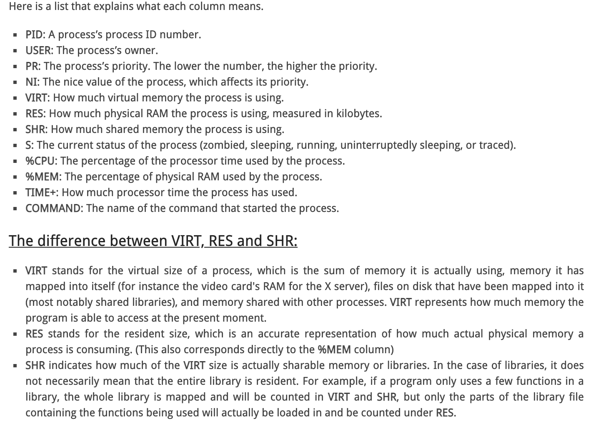

# HTOP
[link](https://www.deonsworld.co.za/2012/12/20/understanding-and-using-htop-monitor-system-resources/#:~:text=VIRT%20represents%20how%20much%20memory,memory%20a%20process%20is%20consuming.)

## What each column mean
