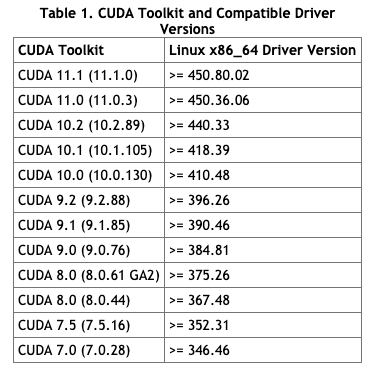

# Upgrading nvidia drivers in server without rebooting
## About
This page would detail the steps to upgrade the nvidia driver in a test server without rebooting the server

Some nvidia drivers in the test servers are outdated and do not support newer versions of Pytorch and Tensorflow, hence an upgrade of the driver is required. 

However do note that this would stop processes that are running on the GPU.

The following methods have only been tested on servers running Ubuntu 16.04 LTS.

## Install your nvidia driver 
### From nvidia
- install from [here](https://www.nvidia.com/Download/index.aspx?lang=en-us)

### Using apt
```bash
sudo add-apt-repository ppa:graphics-drivers/ppa
sudo apt update 
sudo apt-cache search nvidia-driver
# install latest driver available
```

### Cuda Nvidia Driver compatiability tabe


### Checking graphic card
```bash
sudo lshw -C display
```
or
```bash
lspci | grep -i nvidia
```

### Some error you may face and possible solution:
#### ERROR: The Nouveau kernel driver is currently in use by your system:

There is two ways to solve this:
- [blacklist it](https://askubuntu.com/questions/841876/how-to-disable-nouveau-kernel-driver)
- remove the module (recommended as dont need to restart)
```bash
stop X-server: sudo service lightdm stop
unload the nouveau driver: sudo rmmod nouveau
```

#### gcc not installed:
install gcc!
```bash
sudo apt-get install gcc
```
#### server X error
    - [what is server X]()
    - [how to stop and restart an x server x](https://ericplayground.com/2017/09/26/how-to-stop-and-restart-an-x-server-on-ubuntu/)

#### there is some nvidia processes running:
Stop by using the `lsmod | grep nvidia`, `rmmod <module-name>` and `kill <pid>` combo below

#### current installation of nvidia driver may cause some conflict
choose to remove current installation given by nvidia

After this is done you would yield the following error:
```bash
nvidia-smi
Failed to initialize NVML: Driver/library version mismatch
```
A restart would reload your newly installed drivers but there are some circumstances where you are not allowed to do so

The follow section would teach you how to reload without restarting
## Reloading 
This quick fix is summarized in two steps:
1. Unload all nvidia kernal modules
    1. Check to see which modules are loaded using `lsmod | grep nvidia`
    1. unload the modules using `sudo rmmod <module-name>
    1. Sometimes you may encounter the following error: `rmmod: ERROR: <module-name>` in use. You can fix this by first checking which processes are using the GPU and terminate them
        1. Check processes: `sudo lsof /dev/nvidia*`
        1. Kill processes: `kill <pid>`
1. Load your nvidia kernel modules using `nvidia-smi`

## References
- https://flummox-engineering.blogspot.com/2019/12/nvidia-how-to-fix-failed-to-initialize-nvml-driver-library-version-mismatch.html
- https://askubuntu.com/questions/851069/latest-nvidia-driver-on-ubuntu-16-04